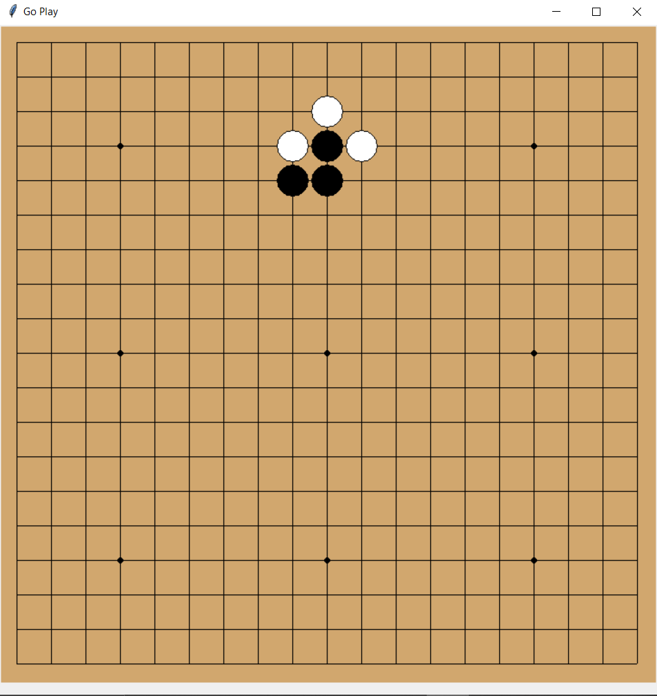

# 🧠 Go Play – AI-Based Go Game (19x19)

**Go Play** is a simple AI-driven implementation of the traditional board game **Go**, developed using **Python** and **Tkinter**. It supports basic Go mechanics (stone placement, liberty checks, territory evaluation, and capturing) and integrates AI using **Minimax** and **Alpha-Beta Pruning** for decision-making.

---

## 📦 Features

- 19x19 Go board rendered using `tkinter`
- Two-player gameplay: Human (`Black`) vs AI (`White`)
- AI decision-making using:
  - **Minimax**
  - **Alpha-Beta pruning**
- Evaluation based on:
  - Captured stones
  - Territory control
- Dynamic scoring system with visual feedback
- Simple heuristic evaluation to guide AI decisions
- Stone capture logic and liberty checks

---

## 🧠 AI Techniques

### 1. **Alpha-Beta Pruning**:
Efficient tree pruning for improved performance while maintaining optimal moves.

### 2. **Heuristic Evaluation**:
- Assigns scores to board positions based on liberties and strategic points.
- Includes two heuristic strategies (`huristic`, `huristic2`), modifiable via code comments.

---

## ▶️ How to Run

### Requirements:
- Python 3.x

### Run Command:

```bash
python "Go Play.py"
```

The GUI window will launch with a 19x19 Go board.

---

## 🕹️ Gameplay Instructions

- **Black** plays first (you).
- Click an empty intersection on the board to place your stone.
- The AI will respond automatically using its chosen strategy.
- Score updates after each move.
- The game checks for valid liberties and captures surrounding groups when applicable.

---

## 📊 Scoring

The evaluation score is computed as:

```
Evaluation = (White Territory - Black Territory) + (Black Captures - White Captures) + 6.5 (Komi)
```

Captured stones and territory are dynamically displayed.

---

## 🛠️ Code Overview

- `create_board()` – Initializes 19x19 board with scoring metadata.
- `apply_move()` / `undo_move()` – Handles player actions.
- `has_liberty()` / `get_liberties()` – Core logic for liberties.
- `capture()` – Captures stones with no liberties.
- `alpha_beta()` / `minimax()` – AI move decision engines.
- `huristic()` / `huristic2()` – Heuristic evaluation functions.
- `evaluate_board()` – Board scoring for AI evaluation.

---

## 📌 Notable Points

- **Switching AI Strategy**: Uncomment the desired heuristic or search strategy in the `alpha_beta()` and `minimax()` functions.
- **Evaluation Depth**: Currently uses a depth of 2. Can be increased for smarter but slower AI.
- **GUI**: Uses `tkinter.Canvas` to render the board and handle events.

---

## 📷 Screenshot




## 📄 License

This project is open-source and available under the MIT License.
